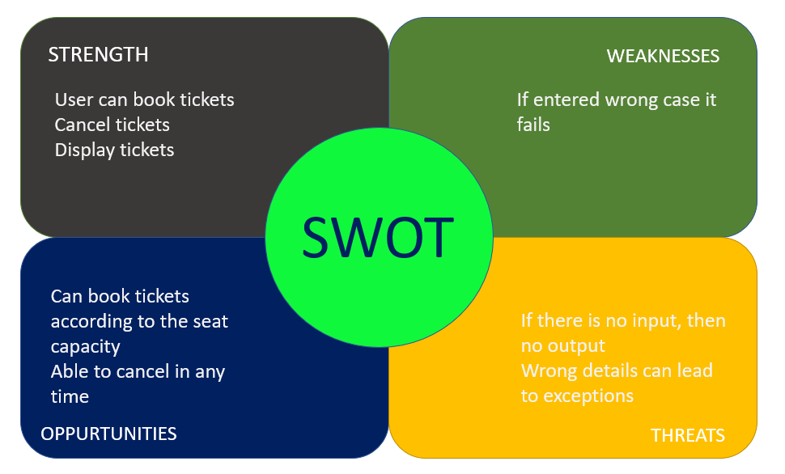

#REQUIREMENTS#

**User Interfaces**
The interface must be easy to understand. The user interface includes:

1.	SCREEN FORMATS: The introductory screen will be the first to be displayed which will allow the users to choose either of the two options, viewing flight detail or booking a ticket.
2.	WINDOW FORMAT: When the user chooses some other option, then the information pertaining to that choice will be displayed in a new window which ensures multiple windows to be visible on the screen and the users can switch between them.
3.	DATA FORMAT: The data entered by the users will be alpha numeric.

**2.	HARDWARE INTERFACE**

The system should basically support the input and output devices 
Their descriptions are as follows.
   Name of Item	    Description of Purpose	     Source of Input/      Description of output
    Keyboard	To accept data from user like pin code, personal details, flight details	Source of Input
    Monitor  	To display the bookings mode E.g.: Destination chosen with date and timings	Destination of Output

**3.SOFTWARE INTERFACE**

Operating System: windows 7/8/10.
RAM: 4/8GB
Graphics card: None
HDD Space: <5
   
**4.REFERENCES**
       https://www.google.com/search?q=uml+diagram+airline+
       reservation+system&rlz=1
              
FUNCTIONAL REQUIREMENTS

**FUNCTIONAL REQUIREMENT 1:**

        PURPOSE: The purpose of this is to enable the users to view the different flights available to make it convenient for him to make a reservation.

        INPUTS: The user must enter the seats with name and must make reservation by giving his personal details like name.

        PROCESSING: Recognizing the correct details are entered that a message is displayed confirming his reservation and displays the pin code.

**FUNCTIONAL REQUIREMENT 2:**

        PURPOSE:  The purpose is to allow the customer to cancel his reservation if not required.

        INPUT: The user should enter his pin code which gives him access to cancel his reservation.

        PROCESSING: The pin code is processed and checked for its validity. If it is correct, then the user can cancel his reservation else an error message will be displayed asking the user to enter the correct pin code number.
        OUTPUT: Given the correct pin code, the user can now cancel his reservation.

**FUNCTIONAL REQUIREMENT 3:**

        PURPOSE: The purpose is to enable the person to his booking.
        INPUT: The person access is given only to him to view the details of his booking.
        OUTPUT: the person can view all the details of booking with date and time of their bookings made.

Algorithm:

 In this phase further I had designed algorithms for various technical sub problem.
 
Reservation: 
        Step 1:   a person comes to reserve a ticket.
        Step 3:   in customer form those details were written.
        Step 4:   then computer check the date what date the person reserved
        Step 5:   then system justify the specific flight id
        Step 7:    if seat is empty then system reserved the seat.
        Step 8:   then ticket is generated.
        Step 9:   the ticket is confirmed.
        Step 10:   if the condition is not applied then it check next seat
        Step 11:   and justified it.
        Step 12:   if it is not also empty then it checks next by next.
        Step 14:   then it give waiting list.
        Step 15:   end.

Cancellation :

        Step 1:    a passenger comes to cancel the ticket
        Step 2:    then the system open the delete form  
        Step 3:    it display all the passenger list
       Step 4:    Step the system show record is deleted.

when  passenger  come  to  reserved  a ticket  then  system  find  out  the  flight  details.

**PERFORMANCE REQUIREMENT**

 At any instant, a maximum of four nodes or users will be given access simultaneously.

 **ATRIBUTES**

    I.	Reliability: The factors needed to establish the software expected reliability are
    The user inputs should be valid and within the given range.
    Normal termination of the program.

    II.	 Availability: The factors guarantee the software’s availability includes proper termination and correct input details. Also, the resources used for the project development are Microsoft Certified which speaks of its high-quality standards.

    III.	 Security: It must be ensured that access will be provided to the authorized persons through user ID and password.
    Network security will be provided using firewalls.
    Checks can be performed at regular intervals to ensure data integrity .

    IV.	 Maintainability: The software will be developed by implementing the concept of modularity which in turn reduces the complexity involved in maintaining it. The administrator should have a sound technical knowledge about maintaining the software and further enhancements will be undertaken by the developer.

    V.	 Portability: The application is portable which ensures its adaptability for use on different computer terminals with different operating systems and standards

**4W's and 1H** 
**Who:** 
Everyone who are able to book the tickets are able to travel 
**What:** 
Airline system is mainly comprised of travelling across the globe 
**When:** 

**Where:** 
User can can access this application using any C compiler. 
**How:** 
Implementation is done using C language. And also used multifile concept. 